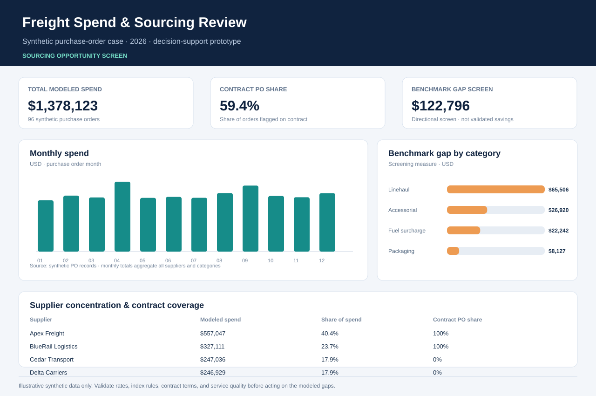

# Procurement Spend and Freight Sourcing BI

## Executive brief

**Decision:** Where should procurement investigate supplier concentration, contract coverage, and freight-rate opportunities?

The reproducible synthetic dataset supports monthly spend, supplier scorecards, category opportunity screens, and procurement review in BI tools.

## Interactive dashboard

Serve the project folder with Python (`python3 -m http.server 8000` while in this directory), then open `http://localhost:8000/dashboard/`. The self-contained prototype includes supplier, category, and month filters; spend, contract-order, and benchmark-gap measures; a monthly trend; supplier concentration; and a leadership readout. No external libraries or network calls are required.

The dashboard is a lightweight portfolio prototype, not a deployed Power BI/Tableau report or live ERP/Coupa integration. Its measures are defined in the browser code and can be rebuilt in Power BI or Tableau from the supplied CSV and SQL.

## Files

- `data/synthetic_procurement_transactions.csv`: 96 fictional purchase orders across suppliers and spend categories.
- `outputs/supplier_scorecard.csv`: spend, PO count, supplier share, and contract mix.
- `outputs/category_opportunity.csv`: category spend and modeled benchmark gap.
- `outputs/monthly_spend.csv`; `outputs/executive_summary.txt`.
- `dashboard/index.html`: interactive prototype.
- `dashboard/data.js`: synthetic PO rows embedded for a portable local demo.
- `dashboard/dashboard-preview.svg`: static dashboard preview for quick review.
- `sql/analysis.sql`: reusable spend and sourcing queries.

> **System boundary:** This resembles a procurement extract but is not an actual Coupa, ERP, or TMS integration. Benchmark gaps are simulated screens, not realized or validated savings.

Run `python3 build_case.py` with Python 3.10+ and the standard library to regenerate the dataset, rollups, interactive dashboard data, and static preview. Load the source CSV into Power BI or Tableau to rebuild spend trend, supplier concentration, category gap, and contract-coverage views.
