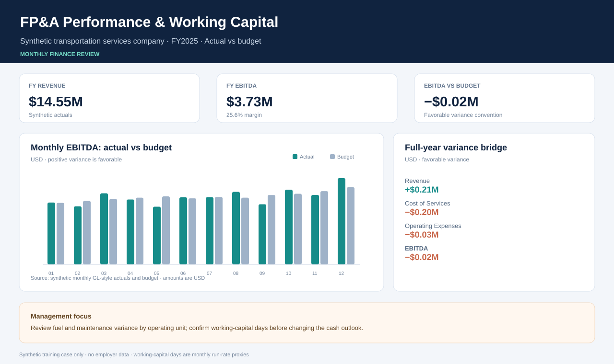

# SQL-Driven FP&A Performance & Working Capital

## Decision

Where did monthly earnings move versus plan, which operating unit explains the gap, and what happened to working capital?

This case models a fictional transportation services company for FY2025 using fully synthetic data. It turns GL-style actuals, budget rows, account mappings, and monthly balance snapshots into a reproducible FP&A review. The analysis includes favorable variance conventions, cost-center ranking, rolling EBITDA, and cash-conversion-cycle proxies.

## Rebuild

From this directory, run:

```bash
python3 build_case.py
```

Python's standard library is sufficient. The script recreates deterministic source CSVs, loads them into an in-memory SQLite database, runs the SQL files, exports analysis tables, and regenerates the dashboard preview. No network calls, external packages, or employer data are used.

## What to review

- `outputs/dashboard-preview.svg`: executive page with revenue, EBITDA, monthly actual-versus-budget trend, and variance bridge.
- `outputs/monthly_performance.csv`: monthly P&L, favorable variance, YTD EBITDA, prior-month EBITDA, and three-month rolling average.
- `outputs/cost_center_performance.csv`: actual-versus-budget view ranked by monthly EBITDA variance.
- `outputs/working_capital.csv`: net working capital, cash-release proxy, and DSO/DIO/DPO/CCC monthly proxies.
- `outputs/performance_bridge.csv`: full-year revenue, cost, operating expense, and EBITDA bridge.
- `powerbi/model-guide.md` and `powerbi/measures.dax`: import plan, relationships, measures, and recommended visuals for rebuilding this in Power BI.



## Model conventions and limitations

- Revenue and expense inputs are stored as positive amounts. Favorable variance is actual less budget for revenue and budget less actual for costs.
- EBITDA is a simplified management proxy: revenue less cost of services and operating expenses. Interest, taxes, depreciation, and amortization are not separately modeled.
- Working-capital balances are generated monthly run-rate assumptions. DSO, DIO, DPO, and cash conversion cycle are directional proxies, not close-quality accounting balances.
- Actuals, plans, units, balances, and company names are fictional. No realized savings or employer performance is represented.

## SQL skills demonstrated

The scripts use joins, conditional aggregation, CTEs, `CASE`, `NULLIF`, `LAG`, `AVG` and `SUM` window frames, `DENSE_RANK`, and unioned variance bridges. Work through `../../learning/sql-practice-path.md` from basic selects through the capstone questions.
